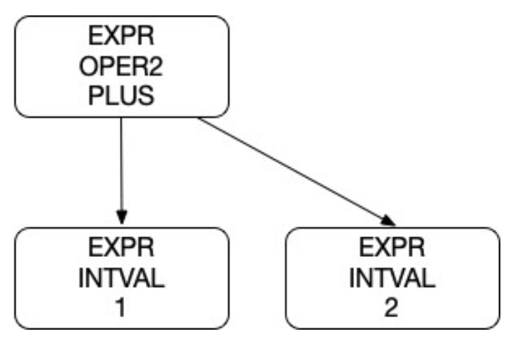
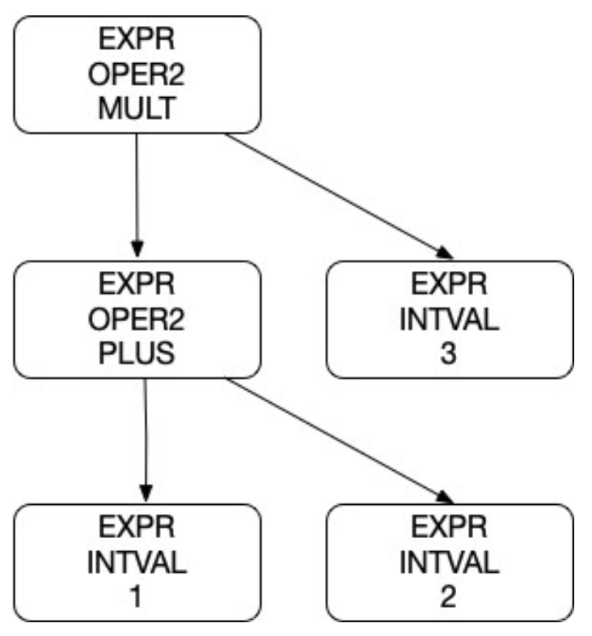

# Parsing for ntlang

## Due Tue Feb 6th by 11:59pm in your Lab02 GitHub repo

## Links

Tests: [https://github.com/USF-CS631-S24/tests](https://github.com/USF-CS631-S24/tests)

Autograder: [https://github.com/phpeterson-usf/autograder](https://github.com/phpeterson-usf/autograder)

## Background

This week in lecture we will develop the foundation for a parser for our little language called ntlang. This lab asks you to expand on the given parser, adding code and data structures to fully implement the scanning and parsing of the language specified in the EBNF.

It is still a future topic to interpret the tree form a program and do something useful with it. This lab covers only parser output.

Parsing refers to the process of identifying acceptable sequences of tokens as defined by a language. For example, our scanner from Lab02 can accept the following:

```text
1 + 2
```

This results in the following sequence of tokens:

```text
TK_INTLIT("1")
TK_OP("+")
TK_INTLIT("2")
TK_EOT("")
```

We now need to "parse" these tokens to see if they represent a valid ntlang program. Parsing will do two things for us. It will determine if a sequence of tokens is a valid program and it will construct a data structure from the tokens that can later be used for interpretation or compilation.

In language parsing we usually form a tree version of the program structure. If we retain all of the syntatic structure of the input, we call the tree a parse tree or concrete syntax tree. If we, elminate some of the syntax, we call the tree and abstract syntax tree. For example, if you parse something like ```(1 + (2 + 3))```, in the tree form, the parens are not needed. The same is true for something like ```if (a > b) { a = 1;}``` the parens, braces and semicolon are not needed in the tree form because they are not needed for the meaning of the program for interpretation or compilation. 

For example, the token sequence above can be represented as the following tree:

{:width="50%"}

The nodes in the tree represent different parts of the structure of a valid program. In this case, the program consists of a single expression. This expression is an operator with two arguments (or operands). The expression operator is a PLUS ("+") and the two operands are both INTVALS. 

We can represent this tree structure as a string:

```text
EXPR OPER2 PLUS
..EXPR INTVAL 1
..EXPR INTVAL 2
```

Now consider the following ntlang program:

```text
(1 + 2) * 3
```

Here are the tokens:

```text
TK_LPAREN("(")
TK_INTLIT("1")
TK_PLUS("+")
TK_INTLIT("2")
TK_RPAREN(")")
TK_MULT("*")
TK_INTLIT("3")
TK_EOT("")
```

Now here is the resulting abstract syntax tree for this token sequence:

{:width="50%"}

Here is the string representation of this tree:

```text
EXPR OPER2 MULT
..EXPR OPER2 PLUS
....EXPR INTVAL 1
....EXPR INTVAL 2
..EXPR INTVAL 3
```

Our goal in parsing is to construct the tree structure of valid ntlang programs. Notice how in both the tree and the string output the parens are no longer present. As noted above, this is because the tree form implicitly represents the grouping that is specified in the parens. So, we discard the parens themselves, but not what they represent in terms of program structure.

For this lab, we are going to simplify the ntlang language so we can focus on the basics of parsing.

Here is the EBNF for the scanner (microsyntax) of our simplified ntlang language:
```text
tokens     ::= (token)*
token      ::= intlit | binlit | symbol
symbol     ::= '+' | '-' | '*' | '/' | '>>' | '>-' | '<<' | '~' | '&' | '|' | '^' | '(' | ')'
intlit     ::= digit (digit)*
binlit     ::= '0b' ['0', '1'] (['0', '1'])*
digit      ::= '0' | ... | '9'

# Ignore
whitespace ::= ' ' | '\t' (' ' | '\t')*
```

We can also represent the structure (grammar) of valid ntlang programs with EBNF:
```text
program     ::= expression EOT
expression  ::= operand (operator operand)*
operand     ::= intlit | binlit 
              | '-' operand
              | '(' expression ')'
operator    ::= '+' | '-' | '*' | '/' | '>>' | '>-' | '<<' | '~' | '&' | '|' | '^' 
``` 

We are going to currently limit valid ntlang programs to expressions. For example, the following are valid expressions:

```text
1 + 2
(1 + 2) * 3
4 * (10 / 5)
(2 * (3 + (1 + 1)))
-4 + 3
-4 + -4
0b1101 + 0b11
(0b1101 >> 2) & 0b10
```

The EBNF for a grammar specifies valid programs in terms of tokens. An expression can be an operand follow by and operator and another operand. An operand can be an integer, or a '-' then an operand, or another expression with in parens.

We also need a data structure in C that will represent the tree structures given above. Here is the struct we will use:

```text
enum parse_expr_enum {EX_INTVAL, EX_OPER1, EX_OPER2};
enum parse_oper_enum {OP_PLUS, OP_MINUS, OP_MULT, OP_DIV};

struct parse_node_st {
    enum parse_expr_enum type;
    union {
        struct {int value;} intval;
        struct {enum parse_oper_enum oper;
                struct parse_node_st *expr;} oper1;
        struct {enum parse_oper_enum oper;
                struct parse_node_st *left;
                struct parse_node_st *right;} oper2;
    };
 };
```

We are going to derive a parser implementation from the EBNF for expressions given above to construct a tree of `parse_node_st struct`. The type of parser we are going to implement is a recursive descent parser. The basic idea is to write a function for each production in the grammar. So, our simplified version of ntlang, we will have three parse functions:

```text
struct parse_node_st * parse_program(struct parse_table_st *pt,
                                       struct scan_table_st *st);
struct parse_node_st * parse_expression(struct parse_table_st *pt,
                                      struct scan_table_st *st);
struct parse_node_st * parse_operand(struct parse_table_st *pt,
                                       struct scan_table_st *st);
```

Given a sequence of token in a `scan_table_st`, we will recursively construct a tree by allocating `parse_node_st` structs from the `parse_table`.

## Requirements

Your job is to implement a parser, called lab02, that will work like this:

```text
$ ./lab02 -e "1 + 2"
EXPR OPER2 PLUS
..EXPR INTVAL 1
..EXPR INTVAL 2
```

That is, the parser will take an input expression on the command line after the "-e" option. It will scan the input expression string, then parse it into a `parse_node` tree. Finally, it will walk the tree to generate the output shown above.

Here is the correct output for the other example expressions above:

```text
$ ./lab02 -e "(1 + 2) * 3"
EXPR OPER2 MULT
..EXPR OPER2 PLUS
....EXPR INTVAL 1
....EXPR INTVAL 2
..EXPR INTVAL 3

$ ./lab02 -e "4 * (10 / 5)"
EXPR OPER2 MULT
..EXPR INTVAL 4
..EXPR OPER2 DIV
....EXPR INTVAL 10
....EXPR INTVAL 5

$ ./lab02 -e "(2 * (3 + (1 + 1)))"
EXPR OPER2 MULT
..EXPR INTVAL 2
..EXPR OPER2 PLUS
....EXPR INTVAL 3
....EXPR OPER2 PLUS
......EXPR INTVAL 1
......EXPR INTVAL 1

$ ./lab02 -e "-4 + 3"
EXPR OPER2 PLUS
..EXPR OPER1 MINUS
....EXPR INTVAL 4
..EXPR INTVAL 3

$ ./lab02 -e "-4 + -4"
EXPR OPER2 PLUS
..EXPR OPER1 MINUS
....EXPR INTVAL 4
..EXPR OPER1 MINUS
....EXPR INTVAL 4

$ ./lab02 -e (0b1010 >> 2) & 0b01
EXPR OPER2 AND
..EXPR OPER2 LSR
....EXPR INTVAL 10
....EXPR INTVAL 2
..EXPR INTVAL 1

$ ./lab02 -e ---------913
EXPR OPER1 MINUS
..EXPR OPER1 MINUS
....EXPR OPER1 MINUS
......EXPR OPER1 MINUS
........EXPR OPER1 MINUS
..........EXPR OPER1 MINUS
............EXPR OPER1 MINUS
..............EXPR OPER1 MINUS
................EXPR OPER1 MINUS
..................EXPR INTVAL 913

$ ./lab02 -e (---(0b11001001) + (0b1111 - 0b10)) - (1-2+(3 + 4))
EXPR OPER2 MINUS
..EXPR OPER2 PLUS
....EXPR OPER1 MINUS
......EXPR OPER1 MINUS
........EXPR OPER1 MINUS
..........EXPR INTVAL 201
....EXPR OPER2 MINUS
......EXPR INTVAL 15
......EXPR INTVAL 2
..EXPR OPER2 PLUS
....EXPR OPER2 MINUS
......EXPR INTVAL 1
......EXPR INTVAL 2
....EXPR OPER2 PLUS
......EXPR INTVAL 3
......EXPR INTVAL 4

$ ./lab02 -e (1 + ((2 +3) + 4
parse_error: Missing right paren
```

## Deliverables

You will be given starter code in the lab02 repo.

Your repo must contain a Makefile which builds an executable called `lab02` using the source files `ntlang.h`, `lab02.c`, `scan.c` and `parse.c`. Optionally `conv.c`.

Use the techniques we learned for reading files and analyzing text to build up a tree of `parse_node_st` structs.

Print out the parse nodes exactly as shown above to get credit for correctness.

## Rubric

100% Lab02 autograder tests.
