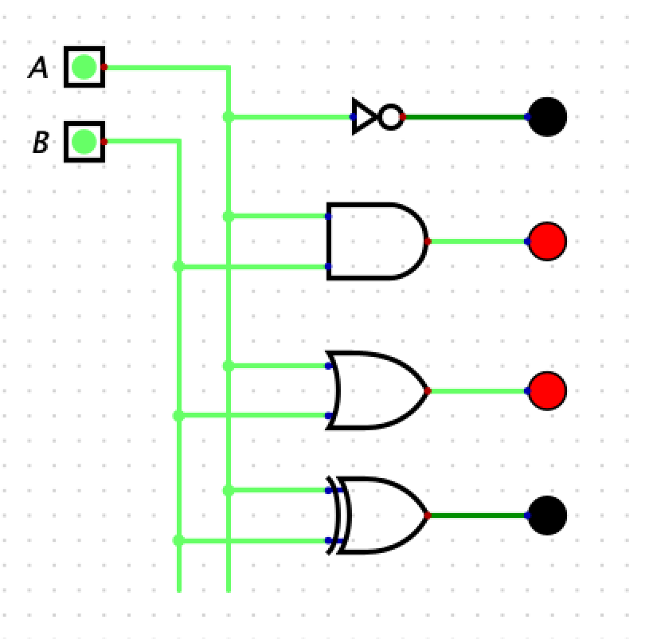
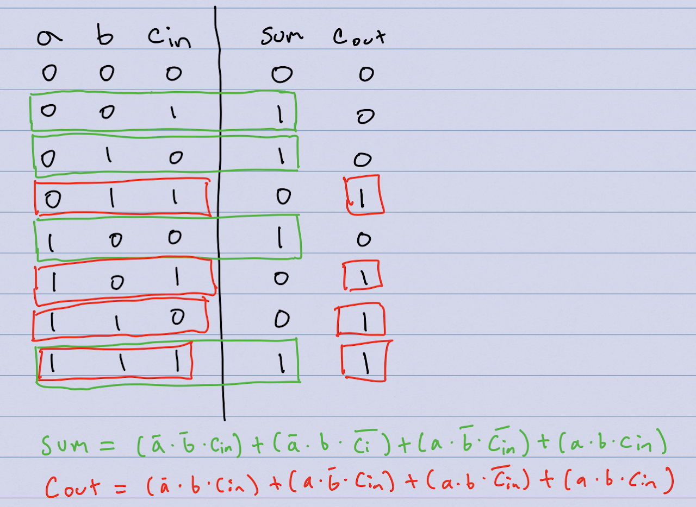
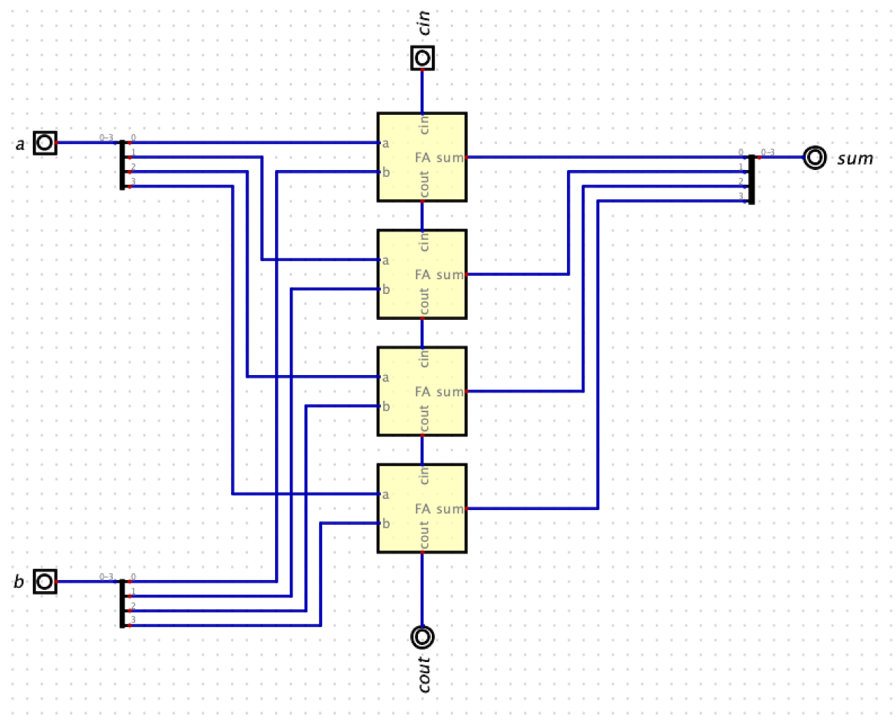
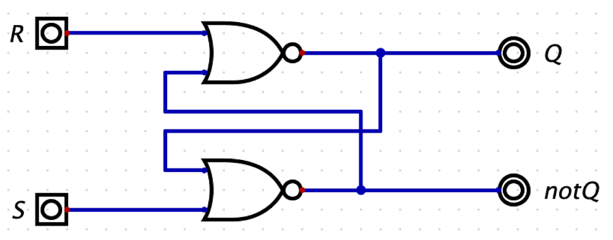
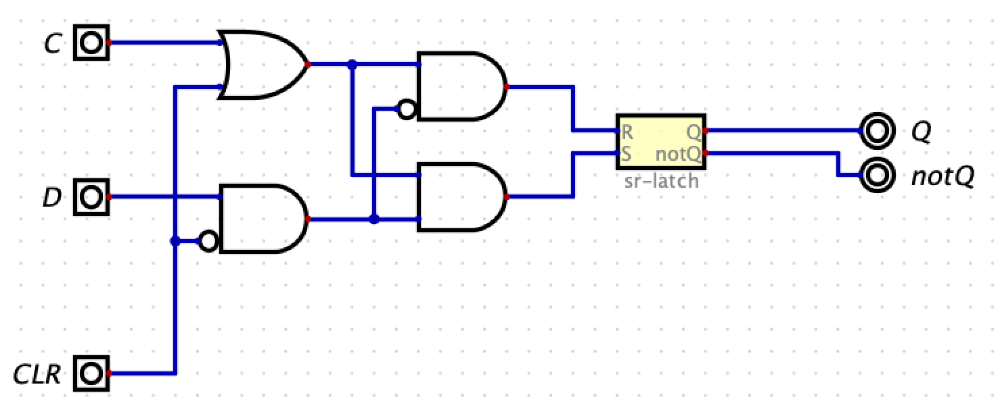
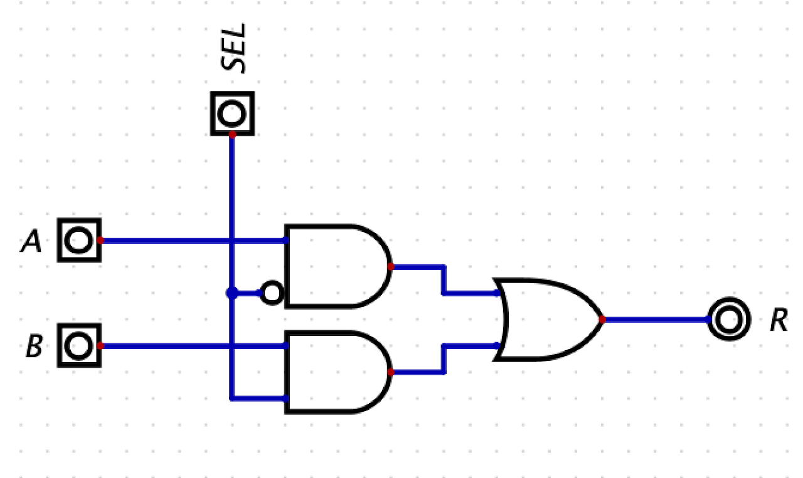

# Digital Design

## Schematics Due Wed April 3rd by 11:59pm in your Lab06 GitHub repo

## Links

Tests: [https://github.com/USF-CS631-S24/tests](https://github.com/USF-CS631-S24/tests)

Autograder: [https://github.com/phpeterson-usf/autograder](https://github.com/phpeterson-usf/autograder)

## Requirements

You will learn the basics of digital logic and digital circuits with the goal of learning enough to build a working computer processor. We will use the Digital application to build and simulate digital circuits:

[https://github.com/hneemann/Digital](https://github.com/hneemann/Digital)

For this lab your are going to build and simulate some simple circuits.

### Circuit 1: LEDs

1. You will build a circuit in with two inputs and 4 LED output that shows how 4 basics gates work: NOT, AND, OR, and XOR.
2. The LED will turn red when the input is high (1) and black when in the input is low (0).
3. Here is a screen shot of the circuit you need to build and simulate. Note that you need to add labels to the inputs (A and B):



### Circuit 2: Max2
Consider the C code fragment below:

    if (a > b) {
        r = a;
    } else {
        r = b;
    }

1. We will assume that a, b, and r are 2-bit values. That is, the only values a, b, and r can be are 0 (0b00), 1 (0b01), 2 (0b10), or 3 (0b11).
2. Your job is to use sum-of-products to come up with a Boolean algebra equation and a circuit that will compute the max value r (which is also a 2-bit value).
1. Your inputs will be `a1`, `a0`, `b1`, `b0` and your outputs will be `r1` and `r0`. So, you will have two Boolean equations, one for `r1` and one for `r0`.
3. Since there are 4 inputs you will have 2^4 (16) rows in your truth table.
4. Submit a working circuit that correctly produces the max value of the two inputs. You do not need to submit the truth table or Boolean algebra equation.
5. Your circuit must have input names `a1`, `a0`, `b1`, and `b0`.
6. Your file must be called `max2.dig`
 
### Circuit 3: 1-bit full adder
1. In lecture, we built a 1-bit half adder (that is, an adder which does not have a carry-in) and showed the Boolean Algebra equation for a 1-bit full adder.
2. You will build a 1-bit full adder in Digital, including a carry-in (`cin`) and a carry-out (`cout`).
Your circuit must have inputs named `a`, `b`, and `cin`, and outputs named `sum` and `cout`.
3. Your file must be named `1-bit-full-adder.dig`
4. Here are the truth table and sum-of-products equations for `sum` and `cout`



### Circuit 4: 8-bit Ripple Carry Adder
1. You will implement an 8-bit Ripple Carry Adder with two 8-bit inputs, a 1-bit Carry In, one
 8-bit result output, and a 1-bit Carry Out.
2. Your circuit must have inputs named `a`, `b`, and `cin`, and outputs named `sum` and `cout`
.
3. Your file must be called `8-bit-ripple-carry-adder.dig`

1. Using your 1-bit full adder, build an 8-bit Ripple Carry Adder.
2. Configure the 1-bit full adder symbol so that the cin is on the top and the cout in on the bottom. You will have to increase the height and width of the 1-bit full adder symbol in Edit -> Circuit Specific Settings.
3. Your 8-bit Adder should have two 8-bit inputs (a and b), a 1-bit carry-in (cin), an 8-bit sum output, and a 1-bit carry-out (cout) output.
You can configure inputs and output to be multiple bit inputs.
You can use a splitter (in the wires section) to split an n-bit wire (a bus) into multiple 1-bit wires (actually the splitter is very flexible and can do more than this). You can also use a splitter to combine multiple 1-bit wires to create a n-bit wire (bus).
Here is a picture of what a 4-bit Ripple Carry Adder looks like. Yours does not need to be identical.




### Circuit 5: SR Latch

A set-reset latch uses "cross coupling" to allow the two NOR gates to store 1-bit of information. Here are valid SR Latch states:

```text
S R | Q notQ
0 0 | 0    1
1 0 | 1    0
0 0 | 1    0
0 1 | 0    1
0 0 | 0    1
1 1 | UNDEFINED
```

Note the SR Latch does not have the clock as an input.



### Circuit 6: D Latch with Clear

The D Latch is built using the SR Latch. The clock is used to latch the D value. When the clock is high, the value D is stored in the SR Latch. When the clock is low, the D Latch holds its previously stored value. The CLR (clear) line sets the SR Latch to 0.



### Circuit 7: 1-bit 2-input Multiplexor (MUX)

The multiplexor is an extremely useful circuit that is used to select between multiple inputs. We need a MUX to build the D Flipflop with Enable and Clear.




## Grading Rubric

**Automated testing**

100 pts: Automated tests

**Circuit Quality**

You need to have a clean repo, consistent naming and indentation, no dead code, no unnecessarily complex code. Any deductions can be earned back.

