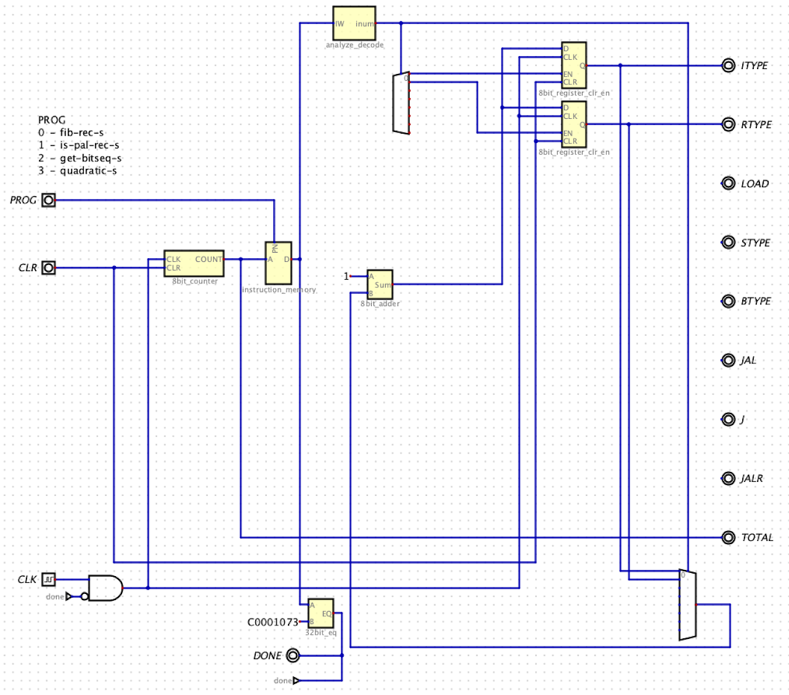

# RISC-V Static Analysis Circuit

## Circuits due Tue Apr 9th by 11:59pm in your Project04 GitHub Repo

## There is no interactive grading for Project04


## Links

Tests: [https://github.com/USF-CS631-S24/tests](https://github.com/USF-CS631-S24/tests)

Autograder: [https://github.com/phpeterson-usf/autograder](https://github.com/phpeterson-usf/autograder)


## Requirements

1. Submit your .dig files (one for each circuit) and .hex files to your assignment repo
1. You will design and build a circuit which analyzes machine code instructions, i.e. a static analyzer
1. Your circuit files must be called `project04.dig`
1. Your circuit will read machine-language instructions from a ROM component and provide a count of the number of total instructions (`TOTAL`) in a program and also count the different instruction types: 
    1. I-type opcode (`ITYPE`)
    1. R-type opcode (`RTYPE`)
    1. Loads (`LOAD`)
    1. Stores (`STYPE`)
    1. Conditional branches (`BTYPE`)
    1. Calls (`JAL`)
    1. Unconditional jumps (`J`)
    1. Ret (`JALR`)
1. Your outputs must be named exactly as listed above
1. You need these inputs, named as shown:
1. A 2-bit input called `PROG` that selects the program to be analyzed
1. A clock named `CLK`
1. A 1-bit input named `CLR` which clears the sequential components
1. To determine the end of a program, your circuit will look for an instruction marker. The marker will be `unimp` (`0xC0001073`). You must add this marker at the end of each program you will analyze.
1. You only need to support programs that contain up to 256 instructions (including the marker).
1. You can use the Digital components: multiplexors, encoders, decoders, gates, splitters, and wires. You must supply all other components yourself including: adders, registers, counters, comparators, instruction storage, and analyzer.
1. Test input: Your instruction storage will contain the machine code for `fib_rec_s`, `is_pal_rec_s`, `getbit_seq_s`, and `quadratic_s` as generated by

    ```sh
    $ objdump -d file.o | python3 makerom3.py > file_rom.hex
    ```
1. Remember to commit your .hex files in your repo

## Given
1. Circuits built in lecture
1. Screen shot of top-level circuit

## Rubric
1. Automated Tests (88 pts.)
1. Circuit Quality (12 pts.)

Partial Top-level Circuit Image



