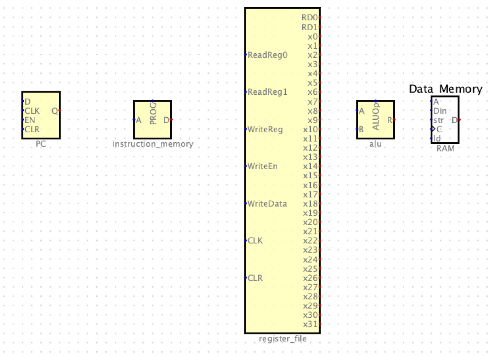
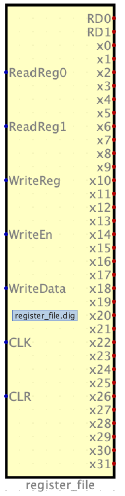
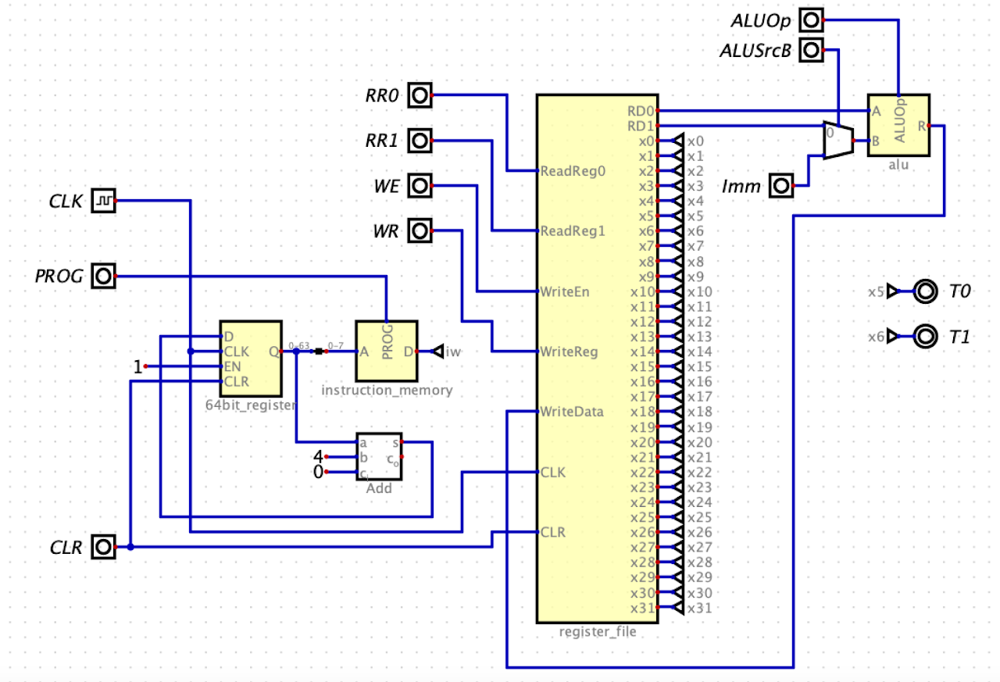

# Processor Design Part 1

The project specs for lab07 and project05 provides high-level requirements. This guide, along with lecture material, will drill down into the details. Using all of this information, you will implement and simulate a single-cycle RISC-V processor in Digital.

## Major Components

1. The PC register will hold the address of the instruction we are currently executing
1. The Instruction Memory holds the machine code representation of our test programs , including the unimp marker instruction
1. You will use the hex output from makerom3.py as input into instruction memory
1. The Register File supports reading and writing from RISC-V registers. We will expose the register values as outputs, so they may be used as inputs to other circuits
1. The Arithmetic Logic Unit (ALU) supports addition, subtraction, multiplication, logical shift left, and logical shift right.  We will also use the ALU to computer branch target addresses and memory target addresses.
1. The Extender supports sign-extension of immediate values. 
1. Data Memory is a Digital RAM component which supports our simulated stack, storing function parameters and preserved register values, as needed.

## PC
1. We will represent PC using a Digital Register component, in the top level of our processor
1. Digital does not provide a CLR input to its registers, but we can add one as our project grows
1. EN will always be 1 so we can move the PC forward 4 bytes on each CLK cycle
1. As in Project04, you will update the PC with a calculated address for JAL and JALR instructions
1. The D output will address the Instruction Memory to retrieve the instruction word at the PC address

## Instruction Memory

1. Instruction memory will be built out of Digital ROM components, starting with one and expanding to more for each simulated function
1. Each RISC-V machine code instruction is 32 bits, so the ROM will have 32 data bits
1. The number of address bits will vary based on the size of your simulated programs. Recall that with 8 address bits, you can address 2^8 = 256 instructions
1. Similar to Project05, note that the ROM is addressed by 32-bit words, but the PC represents a byte address. You can obtain the word address using a splitter
1. You will use makerom3.py to generate a .hex file which can be loaded into the ROM.

## Register File

1. You will create a circuit which supports reading from two registers and writing to one register in the same clock cycle.

**Inputs**
1. `ReadReg0` (5 bits) selects the register value to output on `RD0`
1. `ReadReg1` (5 bits) selects the register value to output on `RD1`
1. `WriteReg` (5 bits) selects the destination register to update
1. `WriteEn` (1 bit) determines whether we will update a register in this clock cycle
1. `WriteData` (64 bits) contains the value we will write to `WriteReg` if `WriteEn` is high
1. `PC` (64 bits) contains the value of the program counter
1. `CLK` (1 bit) is the clock input from the top-level clock component
1. `CLR` (1 bit) allows the register values to be set to zero on a clock tick

**Outputs**
1. `RD0` (64 bits) contains the value of the register specified by `ReadReg0`
1. `RD1` (64 bits) contains the value of the register specified by `ReadReg1`
1. `x0`-`x32` (64 bits) are outputs for the 32 registers 
1. You should use these as inputs to tunnels which are used to build the dashboard on the top-level circuit.
1. You should also reflect `PC` and `PC+4` on the dashboard using tunnels, since that will be useful for debugging branch calculation

## Arithmetic Logic Unit

1. The ALU is a combinational logic component. It does not hold state like sequential logic components, so it does not need a CLK input.
1. Data processing instructions use addition, subtraction, multiplication, logical shift left, and logical shift right.
1. Load/store memory instructions use addition and subtraction to calculate target memory addresses
1. Branch instructions use addition to calculate the target branch address

**Inputs**
1. A (64 bits) is the first ALU operand
1. B (64 bits) is the second ALU operand
1. ALUop (3 bits) selects an ALU operation:
    1. 0b000: add
    1. 0b001: sub
    1. 0b010: mul
    1. 0b100: sll
    1. 0b101 srl

**Outputs**
1. R (64 bits) is the ALU result
1. If you need your ALU to support more operations, you may need to add more selector bits and connect those to the Control Unit

## Initial Top-Level Circuit

1. This starter circuit gives you a general idea of how to start.
    1. It can execute some instructions, with manual help from you.
    1. In order to play with it, you can put instructions into the ROM, and manually enter the RR0, RR1, and WR inputs to the Register File and ALU.
    1. Of course the Control Unit is the big missing piece, which we will discuss separately.
1. Wire up PC = PC + 4
1. Wire explicit inputs to all components
1. Add tunnels and probes to see register state 

