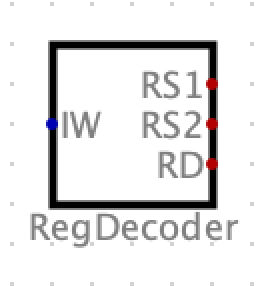
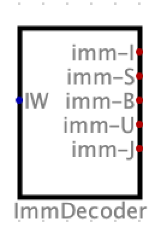
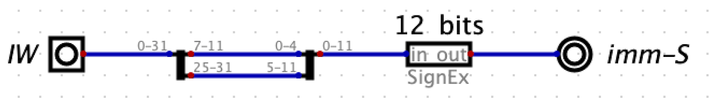
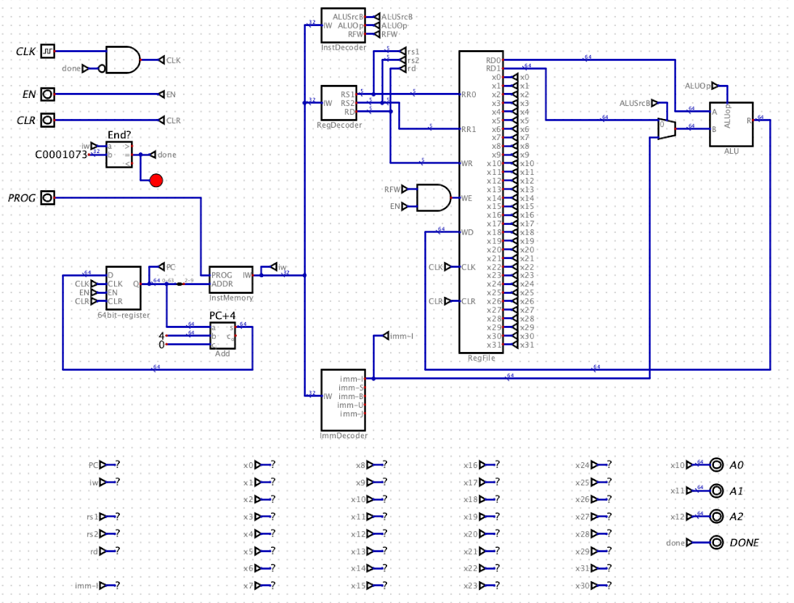
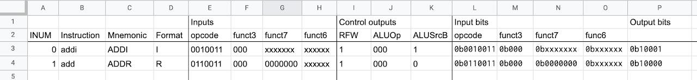
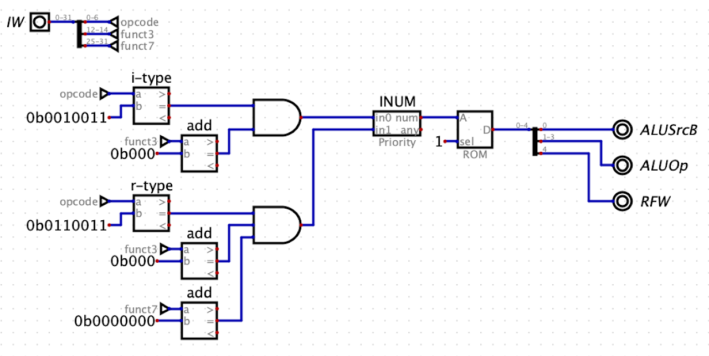
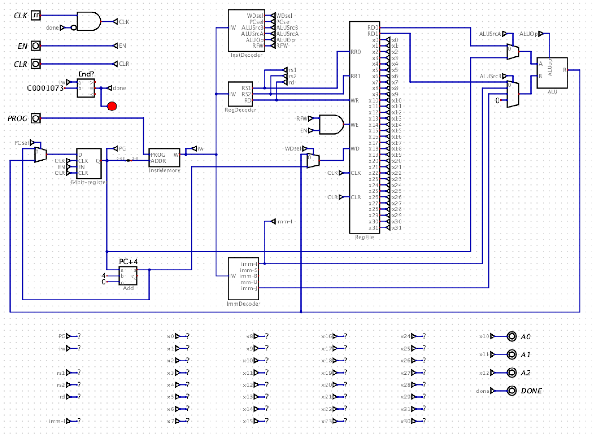
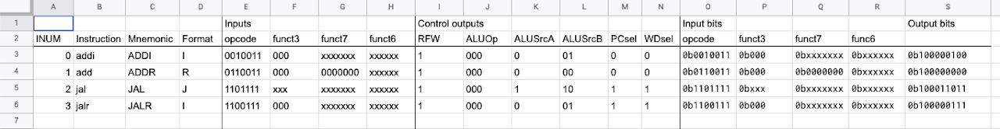
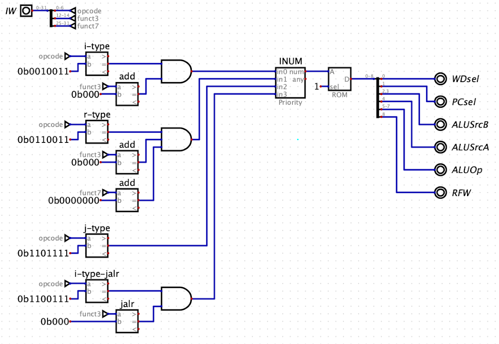
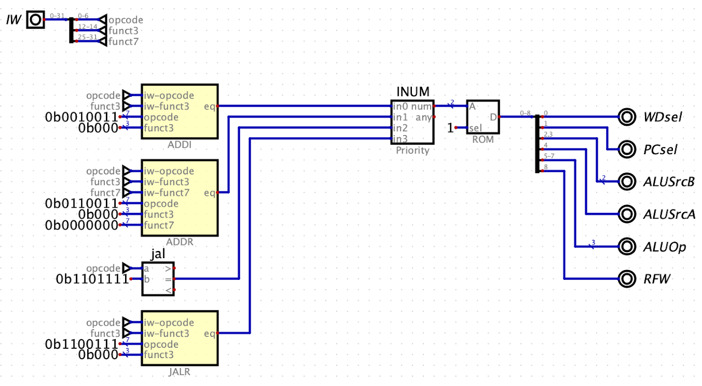

# Processor Design Part 2

In this guide we will extend the the Part 1 processor circuit so that it can automatically execute small programs. The key additions are new data path connections, a register number decoder, an immediate decoder, and an instruction decoder that will correctly set component control lines based on the current instuction word (opcode, funct3, etc.) We develop a spreadsheet-based methodology to systematically associate instruction word inputs with control outputs. The goal, like with sum-of-products, is to provide a tool that you can replicate as you extend your processor with support for more instructions. First we will explain the register decoder (RegDecoder) and the immediate decoder (ImmDecoder).

## The Register Decoder (RegDecoder)



This component accepts a 32-bit RISC-V instruction word and extracts the 5-bit register numbers for RS1, RS2, and RD. This can be implemented with a single splitter.

## The Immediate Decoder (ImmDecoder)



The immediate decoder extract every immediate value for each instruction type that contains and immediate value. For each instruction form, the immediate bits must be extracted from the instruction word, then arranged in proper bit order. The resulting n-bit immediate must then be sign-extended to a 64 bit value. Note that for the processors described in this guide only require I-type and J-type immediates. The other immediate forms will be required later.

For example, here is the circuit need to extract the S-type immediate value:



The sign extender takes a 12 bit signed value and extends it to a 64 bit signed value.

## Our First Processor

In addition to the RegDecoder and the ImmDecoder, we will also need to add new data path connections as well as an instruction decoder (InstDecoder). Here is the first program that will be able to execute:
```
first_s:
    li a0, 1
    li a1, 2
    add a2, a0, a1
    unimp
```
Note this program loads two immediate value into registers a0 and a1. It then adds these values together and puts the result in a2. The unimp instruction is our end marker that is used to tell the processor we have no more instuctions to execute. Note that the li instruction is really a pseudo instruction that is generated as an addi instruction (e.g., addi a0, zer0, 1).
To evolve our partial processor from Part1, we need to add the three deocoders, each of which take the instruction word (IW) as input: RegDeocoder, ImmDecoder, and InstDecoder. The outputs of the RegDecoder will connect to the RegFile, where RS1 connects to RR0, RS2 connects to RR1, and RD conntect to WR. The outputs of the ImmDecoder will be connected directly to the ALUSrcB MUX. Initially we will just connect the imm-I output to the ALUSrcB MUX. Finally, the InstDecoder will take IW as input and provide three outputs: RFW, ALUOp, and ALUSrcB. RFW will connect to the RegFile WE input, ALUOp will connect to the ALU and ALUSrcB will control the ALUSrcB MUX to decide if input B to the ALU comes from the register file or an immediate value. Here is an image of the top-level of our first processor:



You will notice a few new things in this circuit. First, we now have an EN input to the processor. This is useful for controlling when the processor starts executing and gives you time to select the PROG manaully before you begin execution. So, when you simulate this circuit, you will press the play button, then pick your PROG value, then toggle EN to 1. Now your program will start running. EN works by disabling writes to all state elements by default (currently the PC and the RegFile).
Also notice the "dashboard" below the circuit. These are probes connected to tunnels to different values that will help when debugging your processors. On left, we have the PC, iw, RS1, RS2, RD, and imm-I. In the middle we the current values of all 32 registers. To the right we have circuit outputs that are used by the autograder for testing.
While we have explained the RegDecoder and the ImmDecoder, we now need to learn how to build the InstDecoder, which produces the control lines. The idea behind the InstDecoder is to associate IW bit fields with correspoinding control line output values. To assist in developing this association, we will use a spreadsheet. Here is the spreadsheet for InstDecoder in the processor shown above:


Each instruction we support will have a unique INUM. This value will be used to "look up" the proper control line output values. The INUM will correspond to the inputs into a priority decoder. The Instruction column is the RISC-V assembly instruction name and the Mnemonic is a 4 character abbreviation for the instruction that will be used later when we add support in the process to see the instruction mnemonic as it is executing. The Format column is provided for convenience to understand which bit fields we need to interpret for the given instruction.
The Inputs section enumerates the opcode, funct3, funct7, and funct6 fields from the instruction word. Notice that we use "x" to indicate that a bit value is not needed to decode a particular instruction. The Control outputs determine what the components in the processor should do for a given instruction. In case of addi, we want to write the result to the RegFile, so RFW is set to 1, we want the ALU to do an add, so ALUOp is 000, and we want the B input to the ALU to come from an immediate value, so ALUSrcB is set to 1. To the right of the Control outputs, we have convenience columns that simple concatentate "0b" to the beginning of each of the Inputs so that you can cut-and-paste these value into Digital directly. The Output bits column is a concatenation of all the Control outputs. This column will be used to populate a ROM so that we can create a map between the INUM and the control output bits for that INUM.
Here is the InstDecoder circuit:


Notice that we split off the opcode and funct3 and connect them to tunnels. These values are used by comparators to identify each supported instruction. For the R-type add, note we need to compare both the opcode and the funct3 field. We feed the results of the compares into a priority encoder to compute the INUM. This INUM is given as input to a ROM. The ROM contents will be the values from the Output bits column in the spreadsheet. The ROM must be configure with a data size that match the number of contol output bits. We then split the value from the ROM into individual control lines. Note that the order matters. In the spreadsheet lower bit positions are to the left, so in this example ALUSrcB is in bit position 0 and ALUOp is in positions 1-3.

## Support for JAL (call) and JALR (ret)
Now that we can execute an I-type and an R-type instruction we want to further extend our processor to support JAL (call) and JALR (ret). In doing so we wil be able to execute the following program:
```
main:
    li a0, 1
    li a1, 2
    jal first_s
    unimp
first_s:
    add a0, a0, a1
    ret
```
In order to support these instructions we need to add three new MUXes, extend the ALUSrcB MUX, and new data path connections to these components. We need a new MUX to choose between PC+4 or a branch target address (BTA). We call this the PCsel MUX. Both JAL and JALR can update the RD register with PC+4, so we need a MUX that can choose between the ALU result or PC+4 as input into the RegFile WD line. The last new MUX will allow us to send PC to the A input of the ALU for computing the BTA. We call this the ALUSrcA MuX. Finally, we now need to support sending the imm-I value or the imm-J value to the ALU, so we need to extend the number of selector bits to the ALUSrcB MUX. Here is a image of the top-level of the new processor: 


Now with the new components, we also need new control lines for these components. We've expanding the number of outputs from the InstDecoder. Here is the new spreadsheet for this decoder:


When we add new control outputs we need to update these outputs for the original instructions in addition to the new instruction. Usually, this is straight forward because when adding new MUXes it is usual to have the first input to the MUX (input 0) be the original input. Therefore, we almost always set the new control line output values to 0 for existing instructions. Here is the new circuit for this spreadsheet:



Notice how we need to expand the number of inputs into the priority encoder and we now have a larger output value from the ROM that needs to be split appropriately to extract each of the control lines.

It is possible to simplify the the left hand side of the circuit by creating parameterized sub-circuits for doing comparisons:


