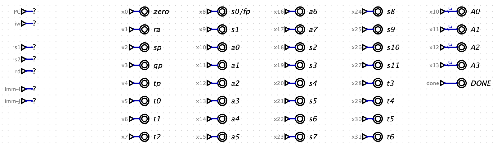

# Processor Design Part 3

This last guide will give an overview of the last two big components that need to be added to complete the processor: conditional branching and data memory. Unlike, Part 1 and Part 2, this guide will just be a high-level overview. More detail was provided during lecture and lab. This guide also provide a suggested way to construct the register dashboard and gives some general debugging tips.

## Conditional Branching

Unlike JAL and JALR, the conditional branch instructions BEQ, BNE, BLT, and BGE will either update the PC to PC + 4 or the branch target address (BTA). JAL and JALR always update the PC to the BTA. The conditional branches need to determine if the branch will be taken by comparing the two register values designated by RS1 (RD0) and RS2 (RD1). So, we need to do three things:

1. Compute BTA. BTA = PC + imm-b, where imm-b is the 64 bit signed extended immediate from the b-type instruction format. This will come from your ImmDecoder.
1. Detemine if the branch will be taken using a comparison. Use can use the Digital comparator for each of the 4 types of comparison.
1. Update the PC based on the result of the comparison.

First you need to figure out where you should compute the BTA and where you should do the comparson. You could do either in the ALU, but not both. Since we already use the ALU to compute the BTA for JAL and JALR it makes sense to use the ALU for the conditional branch BTA computation. This means you need to put the comparisons in a separate unit, called the Branch Unit (BU).
The Branch Unit will take RD0 and RD1 as input as well as a BUOp control line. The BUOp will determine which comparison should be used, if any. Currently PCsel determines if the PC will be updated with PC + 4 or the BTA. You need to arrange the circuit to conditionally update the PC as a result of the comparison. You have options on how to structure this as explained in class.

## Data Memory

We need a way to allow our programs to store and load data, for our programs this will be on the stack, but we could also have a heap if we wanted. We need to support ld/sd, lw/sw and lb/sb. We can use the Digital RAM component (RAM Separated Ports). You can pick the data size with the data bits and the number elements with the address bits. We can support ld/sd easily by using 64 data bits. This will allow you to read (ld) a 64 bit value at the given double word (DW) address on the A (ADDR) input and write (str) a 64 bit value at the address A. Some things to note:
- The A (ADDR) input will be a DW address. However, the target address calculated by the ALU will be a byte address (all addresses are represented at byte addresses in registers). This means you need to convert the byte addr into a DW addr. You can do this byte dividing the byte addr by 8 or right shifting by 3. You can do the shift and match the addr bits of the RAM with a splitter.
- For loads, you will need to route the D output of the RAM back to the register file. You can either expand the WDsel MUX or you can introduce a new two input MUX that selects between the ALU Result and RAM based on a new control line (M2R). The output of the M2R MUX can go into the second input of the WDsel MUX.
- You will need control lines form the InstDecoder: LD, ST, MZS (more below), and M2R or expanded WDsel bits.
- For lw/sw and lb/sb, we will need to augment the RAM with additional logic in order to read and write smaller sized values from the 64 bit memory. When doing this, you still want to keep the RAM component at the top level of your processor circuit because this is the only way to open up the RAM during simulation to the contents. So you will add load logic after the RAM component and store logic before the RAM component. We will outline lw and sw below and from this you should be able to derive support for lb and sb.

**Load Word (lw) for 64-bit RAM**

For load we need to read a 32 bit value from the 64 bit value from RAM. First, you will use the ALU to compute the target address just like for ld. This will be a byte address, but for lw it will be 4-byte aligned, that is is will be a byte addres that is a multiple of 4. The splitter described above will convert this byte address into a DW address. Once you have the 64 bit value we need to extract the lower 32 bits or the upper 32 bits. We can do this by splitting the 64 bit value into two 32 bits values 0-31 and 32-63. These two values can be inputs into a MUX that chooses the lower or the upper. The choice comes from the 3rd bit of the byte ADDR. Recall that bits 0 and 1 are considered the byte index of a word. The third bit, bit 2, is word index. So we can use bit 2 (2-2) as the MUX selector input. This result of this MUX is a 32 bit value that must be sign extended to 64 bits. This 64 bit value can be connected to another MUX that selects the appropriate D output based on the data size control line (MSZ). You will need to support selecting the full 64 bits value from RAM for ld, the 32 bit sign extended to 64 bits value for lw, and the 8 bit signed extended to 64 bits value for lb. If you follow the ordering in the RISC-V spec the value are lb (0b00), lw (0b10), and ld (0b11).

**Store Word (sw) for 64-bit RAM**

Store word is slight more complicated because we need to read the current 64 bit value that olds the 32 bits we want to update. The idea is that we read the current 64 bit value, then modify just the 32 bits as determined by the word index bit (2) from the target address. So, for sw and sb, you need to set the RAM str and ld lines both to 1 so we can read and write RAM in the same clock cycle. So, the store logic will take the current 64 bit value from RAM at ADDR, call it D64cur and the update value from RD1, call it D64in. We need to extra the lower 32 bits (Wnew) from D64in, then combine it with D64cur to create new 64 bit value that will be connected to the Din of the RAM. There are two approaches: you can use splitters and MUXes or you can use shifts and masks. We will descibe the splitter approach.

For the splitter approach, you can extract both 32 bit values from D64cur, call them W0 and W1. Now you can use to mergers to construct Wnew + W1 and W0 + Wnew. This two 64 bit value can be connected to a MUX that is controlled by the word index (bit 2). The result of this MUX goes to a MSZ (memory size) MUX that will select between the sb value, sw value, or the sd value. This will be connected to the RAM Din.

## Register Dashboard 

Here is a proposed register dashboard that uses outputs and maps the register numbers (x0, x1, etc.) with the ABI names (a0, a1, t0, etc.):

## Development and Debugging Tips

Here are few tips for development and debugging.
1. Develop your circuit and instruction decoder incrementally. Do not try to construct and giant decoder spreadsheet first. This will make it harder to track down problems you may introduce.
1. Paste the .dig tests into to your processor circuit so you can run test directly in Digital and see why a test is failing.
1. Even with (2) you will eventually have to single step a test in order to find out what is going wrong. I suggest doing an objdump of the test code so you can see both the hex instruction words and the assembly language. You can check each instruction one by one to find out which instruction is not executing properly.
1. To help with (3) you can add more probes to your processor circuit to see all the intermediate values on the data path. In this way you should be able to see if the problem is a incorrect control line or incorrect value from a component like ImmDecoder or the ALU.
